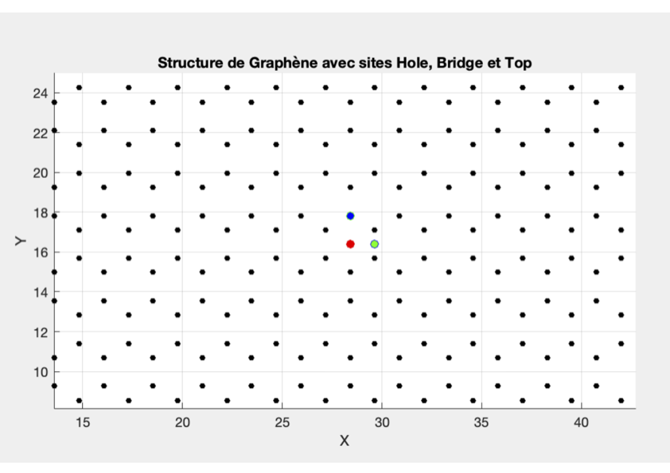
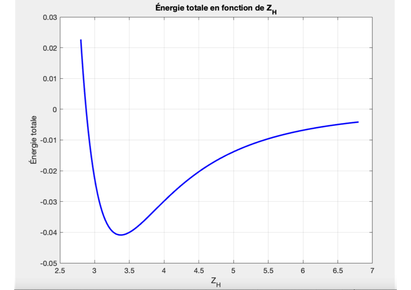
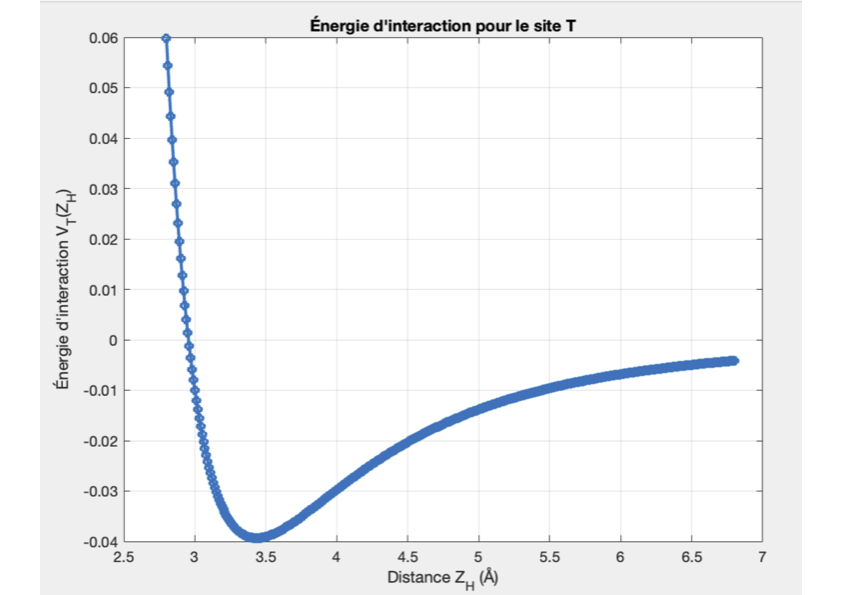
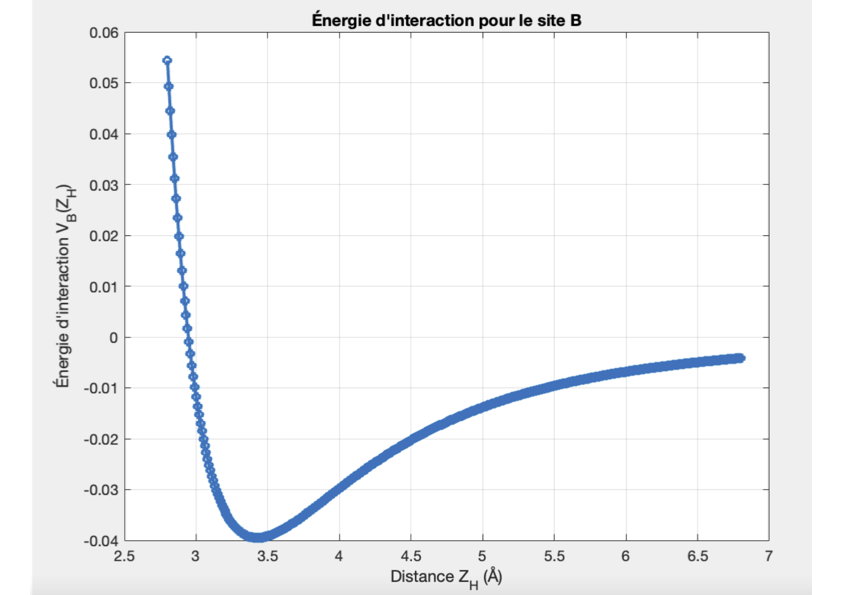
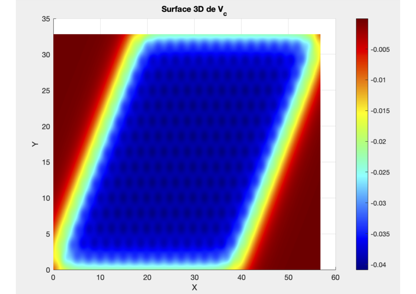
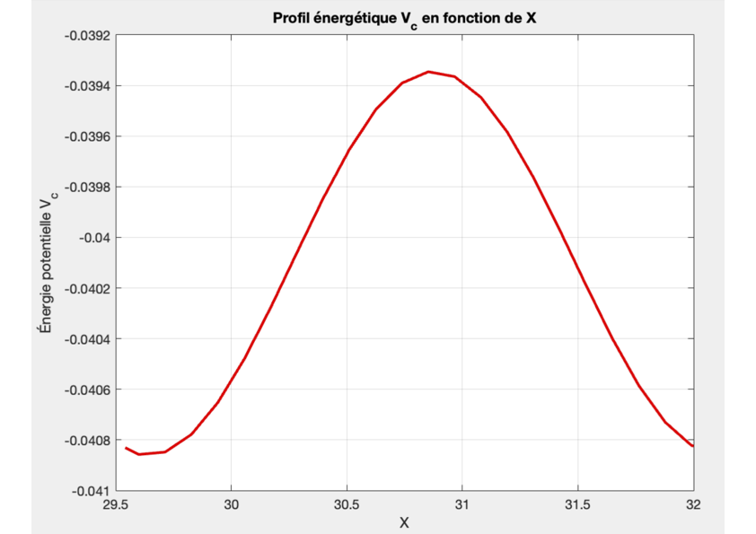
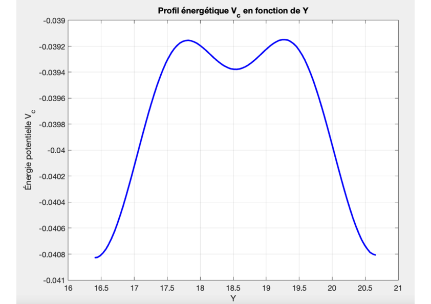

/# Graphene Cohesion Energy Simulation

This project numerically evaluates the **cohesion energy** between a single atom (adatome) and a graphene sheet using the **Lennard-Jones potential**. We explore adsorption energies at three different sites — Hole, Top, and Bridge — and generate a potential energy surface to visualize atomic migration paths.

---

## 🧭 Objectives
- Compute interaction energy between a single atom and graphene.
- Identify the most stable adsorption site (Hole, Top, or Bridge).
- Generate 2D and 3D potential energy landscapes.
- Study the potential energy profiles between neighboring sites.

---

## 🧪 Introduction
### What is an Adatom?
An **adatome** is a free atom that adheres temporarily or permanently to a surface. On a graphene lattice, it can adsorb onto different sites depending on the energy landscape.

### Lennard-Jones Potential
The interaction is modeled by the **Lennard-Jones potential**:

$$
V_{LJ} = \sum_{i=1}^{N} \left( \frac{B}{r_i^{12}} - \frac{A}{r_i^6} \right)
$$

Where:
- $$r_i$$ is the distance between the adatom and carbon atom $$i$$
- $$N$$ is the number of atoms in the sheet
- $$A = 15.2\ \text{eV},\ B = 24100\ \text{eV}$$ for graphene

- The $$r^{-12}$$ term models electron orbital repulsion
- The $$r^{-6}$$ term models van der Waals attraction

---

## 📌 Adsorption Sites on Graphene
Graphene has a hexagonal lattice with three principal adsorption sites:

- **Hole (H):** Center of a hexagon
- **Top (T):** Directly above a carbon atom
- **Bridge (B):** Midpoint of a C–C bond

### Geometric Placement
Using symmetry and lattice constants, the coordinates of the three sites are derived:
- $$d = \frac{pm}{2\cos(\pi/6)}$$ (interatomic distance)
- $$D = \sqrt{\frac{3}{4}}d$$ (Hole to Bridge)

Coordinates:
- $$X_H = \max(X_s)/2\ ,\ Y_H = \max(Y_s)/2$$
- $$X_T = X_H\ ,\ Y_T = Y_H + d$$
- $$X_B = X_H + D\ ,\ Y_B = Y_H$$

---

## 💻 Pseudocode Summary
1. Build graphene atom coordinates.
2. Define site positions (H, T, B).
3. Compute LJ potential for variable Z-heights.
4. Plot energy vs Z for each site.
5. Generate a colormap at fixed height.
6. Analyze paths between two Hole sites via Top and Bridge.

---

## 🧱 Graphene Construction
The graphene sheet is built using two base atoms per cell and translations using primitive vectors. Key parameters include:
- Lattice constant $$pm = 2.47\ \text{Å}$$
- 2D coordinates stored in $$R_n$$

Visualization confirms correct geometry and site placement.

---

## 📉 Cohesion Energy Profiles
### Hole Site (H)
Energy is computed for $$Z \in [2.8, 6.8]\ \text{Å}$$.

- Minimum energy: **0.042 eV**
- Equilibrium height: **3.8 Å**

### Top (T) and Bridge (B)
- Top:
  - Min: **0.040 eV** at **3.4 Å**
    

- Bridge:
  - Min: **0.039 eV** at **3.41 Å**
    

---

## 🌍 Potential Energy Surface
A colormap is generated at $$Z = 3.38\ \text{Å}$$ (Hole equilibrium) over a 2D domain.

- Colors represent potential magnitude
- Darker regions indicate stable adsorption
- Reveals symmetry of hexagonal lattice

---

## 🧭 Energy Barriers Between Sites
We evaluate the energy profile for an adatom moving:

- **Hole → Bridge → Hole**
- 

- **Hole → Top → Top → Hole**
  

Observation:
- Both have same peak energy
- Bridge transition path is **narrower**, hence more favorable

---

## ✅ Conclusion
This simulation provides an in-depth visualization of how an atom interacts with a graphene surface. We have:
- Validated physical assumptions with numerical plots
- Compared stability between sites
- Visualized atomic migration barriers

This project bridges **solid-state physics**, **numerical modeling**, and **visual data analysis** — offering a framework applicable to nanotech, surface science, and catalysis.

---

## 🛠️ Tools Used
- Lennard-Jones potential
- Numerical integration
- Scientific plotting

## 📂 File Structure
- `main_script.m`: Contains all calculations
- `plots/`: Folder for colormap and potential surface figures

Feel free to explore and adapt for your own simulations. Contributions welcome!
